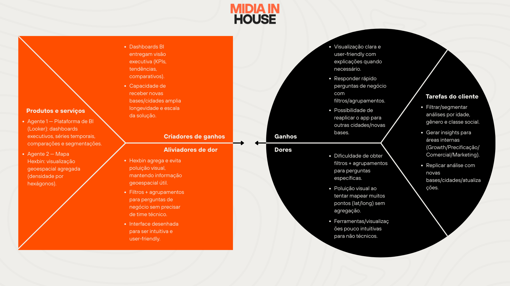

## Introdução

O Value Proposition Canvas (VPC) estrutura a relação entre o que a solução oferece e o que o cliente precisa. De um lado ficam os produtos, aliviadores de dor e criadores de ganho. Do outro, as tarefas, dores e ganhos do cliente.

Aqui, o VPC foi usado para mostrar como a Plataforma de BI (Looker) e o Mapa Hexbin atendem às necessidades das personas Mário (executivo) e Carmen (analista) dentro da Eletromidia.

---

## Tarefas do Cliente

As tarefas centrais dos clientes envolvem a capacidade de filtrar e segmentar análises por idade, gênero e classe social, permitindo compreender com precisão o perfil demográfico do fluxo em diferentes regiões e horários. Essa segmentação é essencial para gerar insights relevantes para áreas internas como Growth, Precificação, Comercial e Marketing, que dependem de dados estruturados para planejar campanhas, definir estratégias e justificar decisões de investimento. Além disso, é fundamental que essas análises possam ser replicadas com novas bases de dados, atualizações periódicas ou aplicação em outras cidades, garantindo escalabilidade, consistência metodológica e continuidade estratégica no uso da ferramenta.

---

## Dores do Cliente

As dores identificadas estão diretamente relacionadas à complexidade e ao volume dos dados disponíveis. Embora exista grande quantidade de informação sobre fluxo de pessoas, sua visualização não é trivial, o que torna esses dados pouco utilizáveis e dificultam a geração de insights para a maior parte dos clientes internos.

Uma das principais dificuldades é obter filtros e agrupamentos que permitam responder perguntas específicas de negócio. Além disso, ao tentar visualizar muitos pontos geográficos simultaneamente, ocorre poluição visual, o que compromete a interpretação espacial. Outro problema relevante é a utilização de ferramentas pouco intuitivas para usuários não técnicos, o que aumenta a dependência de equipes especializadas para extrair análises.

Para Mário, a dor se manifesta na falta de uma plataforma de insights. Para Carmen, na dificuldade de cruzar variáveis com agilidade e autonomia.

---

## Ganhos Desejados

Os ganhos esperados pelas personas incluem visualização clara e user-friendly, rapidez na obtenção de respostas para perguntas de negócio e capacidade de reaplicar a análise em novas bases ou cidades.

Mário busca uma visão consolidada que permita leitura estratégica imediata. Carmen deseja autonomia analítica, segmentação eficiente e capacidade de aprofundamento nas análises. Ambos valorizam confiança nos dados apresentados e reprodutibilidade dos resultados.

---

## Proposta de Valor

A proposta de valor se estrutura em dois agentes complementares: a Plataforma de BI e o Mapa Hexbin. Essa divisão não é apenas técnica, mas estratégica, pois cada componente atende a dimensões diferentes das necessidades das personas.

A Plataforma de BI entrega dashboards executivos, séries temporais, comparações e segmentações. Ela permite organizar os dados de maneira estruturada, permitindo análise por indicadores, tendências e recortes específicos. Para Mário, isso significa visão estratégica consolidada. Para Carmen, significa capacidade de cruzamento de variáveis e justificativa técnica para decisões comerciais.

O Mapa Hexbin, por sua vez, atua na dimensão geoespacial. Ao agregar dados por densidade em hexágonos, reduz a poluição visual causada por múltiplos pontos individuais e mantém a informação territorial inteligível. Ele permite identificar hotspots, analisar concentração por região e estudar áreas de influência.

---

## Aliviadores de Dor

A combinação entre BI e Hexbin atua diretamente sobre as dores identificadas. A agregação espacial por hexágonos reduz a sobrecarga visual e melhora a interpretação geográfica. Os filtros e agrupamentos disponíveis na plataforma eliminam a necessidade de manipulação manual de dados ou dependência constante de equipe técnica. A interface desenhada com foco em usabilidade reduz a barreira de entrada para usuários não técnicos.

Dessa forma, as dores relacionadas à complexidade, à dificuldade de segmentação e à baixa intuitividade são tratadas de forma estrutural pela arquitetura da solução.

---

## Criadores de Ganho

Além de resolver problemas existentes, a solução cria ganhos adicionais. Os dashboards executivos elevam o nível estratégico da análise. A capacidade de ingestão de novas bases e replicação em outras cidades amplia a longevidade e a escalabilidade do projeto. A rapidez na resposta a perguntas de negócio gera eficiência operacional. A segmentação demográfica integrada à análise espacial aumenta o valor comercial das informações produzidas.

Esses criadores de ganho transformam a solução de um simples visualizador, em uma infraestrutura de inteligência geoespacial que pode sustentar decisões estratégicas e desenvolvimento de novos produtos.

---

## Conclusão

A aplicação do Value Proposition Canvas ao projeto evidencia um alinhamento consistente entre as necessidades das personas e a estrutura da solução proposta. As tarefas de Mário e Carmen são diretamente suportadas pelos dois agentes da interface. As dores identificadas encontram alívio específico na combinação entre visualização executiva e agregação espacial. Os ganhos desejados são ampliados pela escalabilidade e pela capacidade analítica da ferramenta.

O resultado é um encaixe claro entre problema e solução. A solução não apenas organiza dados complexos, mas transforma fluxo massivo de informação em inteligência acionável, reduzindo dependência técnica, ampliando autonomia das áreas de negócio e fortalecendo a capacidade estratégica da Eletromidia.
