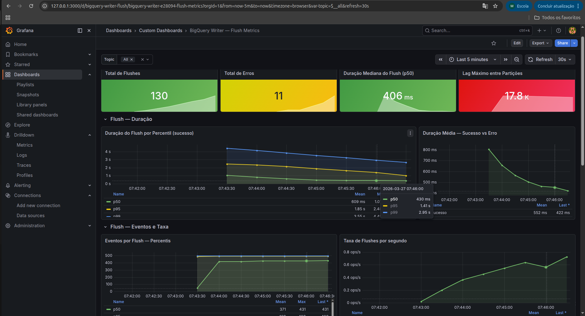
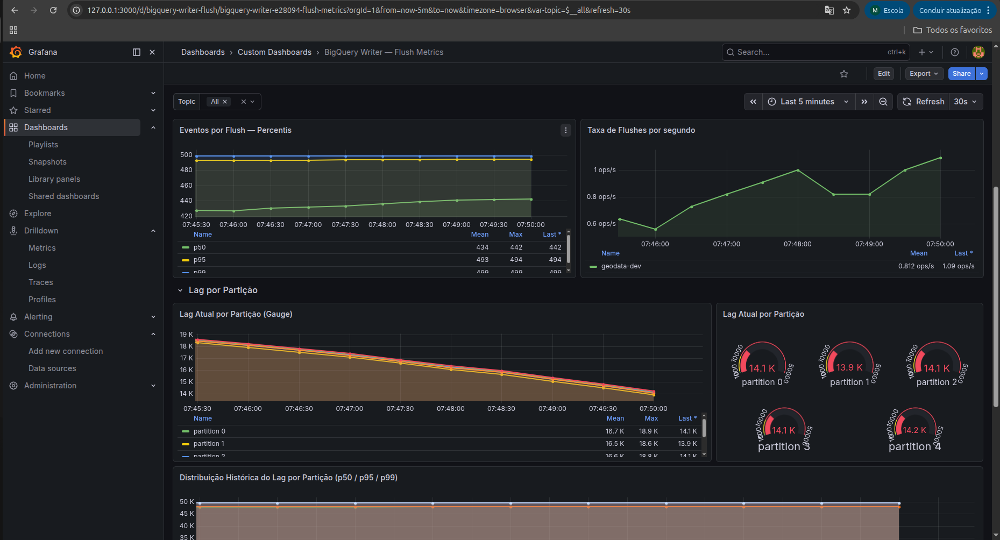
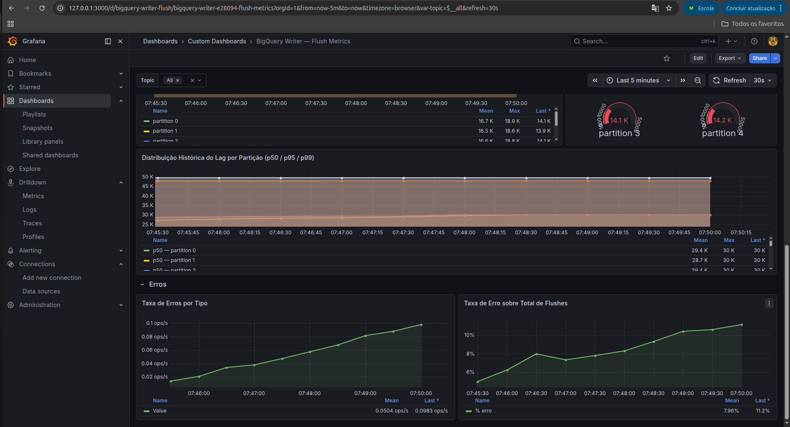
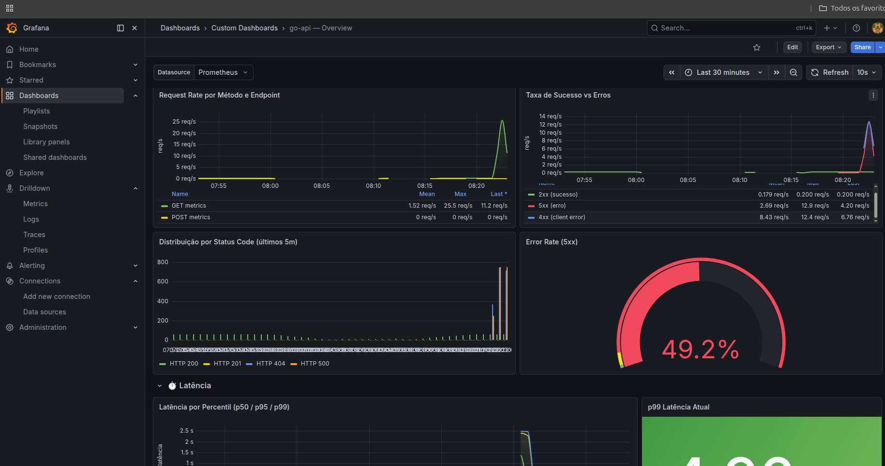
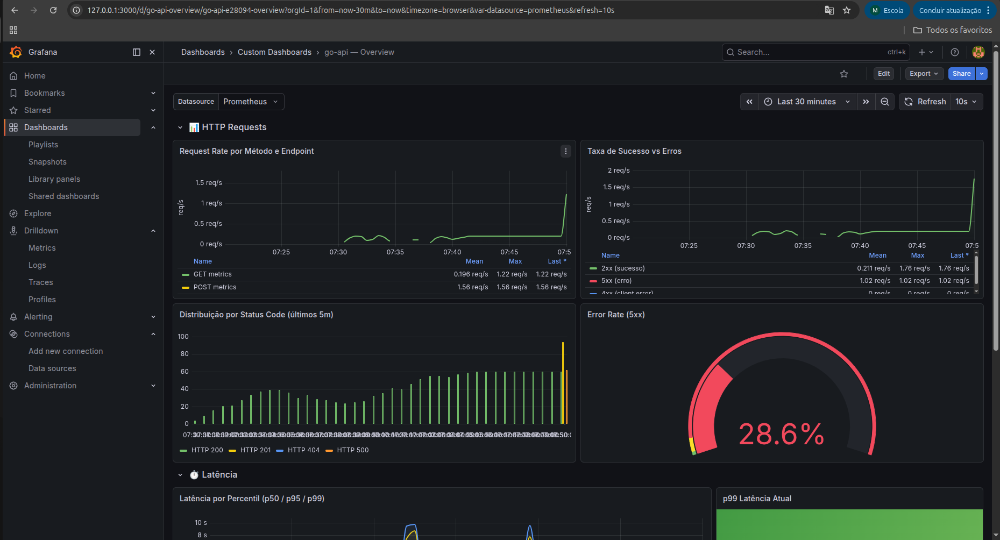
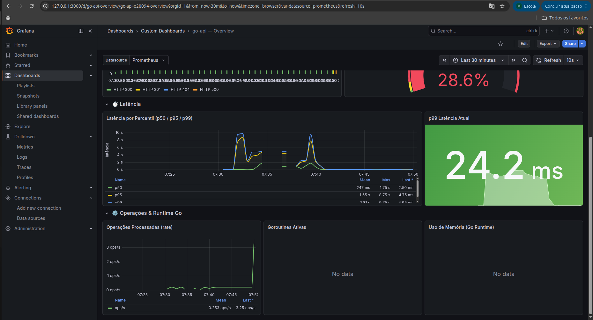

Esta seção documenta a stack de observabilidade do projeto, abrangendo a instalação do Prometheus e Grafana via Helm no cluster GKE, a instrumentação custom do serviço BigQuery Writer e os dois dashboards Grafana criados para monitoramento.

---

## Instalação via Helm — kube-prometheus-stack

O Prometheus e o Grafana são instalados juntos através do chart `kube-prometheus-stack`, mantido pela comunidade `prometheus-community`. A instalação é orquestrada por um `Makefile` localizado em `src/kubernetes/internal`.

```makefile
.PHONY: install-prometheus
install-prometheus:
	helm repo add prometheus-community https://prometheus-community.github.io/helm-charts
	helm repo add stable https://kubernetes-charts.storage.googleapis.com/
	helm repo update
	helm install prometheus prometheus-community/kube-prometheus-stack -n monitoring
```

O chart provisiona automaticamente no namespace `monitoring` o Prometheus Operator, o Prometheus, o Alertmanager, o Grafana e um conjunto de exporters e regras pré-configuradas para o Kubernetes (métricas de nó, Pod, deployment, etc.). A adoção do Operator em vez de uma instalação manual significa que a configuração de scrape targets e regras de alertas é feita via Custom Resources (`ServiceMonitor`, `PrometheusRule`), mantendo tudo dentro do modelo declarativo do Kubernetes.

---

## BigQuery Writer — Instrumentação Custom

A prova de conceito de observabilidade foi implementada no serviço **BigQuery Writer**, um consumer Kafka escrito em Go responsável por ingerir eventos do tópico `geodata` e persistir os dados normalizados em cinco tabelas do BigQuery.

### Arquitetura do Serviço

O serviço é composto por três camadas principais:

**Consumer** (`internal/consumer`) — Lê mensagens do Kafka usando `kafka-go`, acumula no buffer do Writer e dispara o flush quando o buffer atinge o limite de capacidade (`FLUSH_SIZE`, padrão: 500 mensagens) ou quando o ticker de tempo é acionado (`FLUSH_INTERVAL`, padrão: 30s). O mecanismo de duplo gatilho garante que nenhuma mensagem fique retida por tempo indeterminado mesmo em volumes baixos.

**Writer** (`internal/writer`) — Mantém um buffer protegido por mutex e realiza o flush assíncrono das mensagens para o BigQuery. Cada evento Kafka é deserializado, validado e expandido em cinco registros relacionais (tabelas `age`, `gender`, `social_class`, `target`, `geodata`). Os IDs de cada linha são gerados de forma determinística via UUID v5 (SHA-1), usando como semente a combinação de `topic + partition + offset + table`, o que garante idempotência nas inserções — reprocessar a mesma mensagem não cria duplicatas.

**Metrics** (`internal/metrics`) — Expõe um registry Prometheus isolado (`prometheus.NewRegistry()`), evitando conflito com o registry global. As métricas são servidas no endpoint `/metrics` na porta `8080`, junto com o endpoint de health check `/healthz`.

### Métricas Implementadas

Todas as métricas seguem o prefixo `kafka_consumer_` e são labeladas por `topic`, permitindo filtragem por tópico no Grafana.

| Métrica | Tipo | Labels | Descrição |
|---|---|---|---|
| `kafka_consumer_flush_event_count` | Histogram | `topic` | Distribuição do número de eventos enviados por flush. Buckets: 1 → 500. |
| `kafka_consumer_flush_duration_seconds` | Histogram | `topic`, `status` | Latência do flush do disparo até a confirmação do BigQuery. Buckets: 10ms → 30s. O label `status` diferencia flushes bem-sucedidos (`sucess`) de falhos (`error`). |
| `kafka_consumer_partition_lag` | Gauge | `topic`, `partition` | Lag instantâneo por partição no momento do flush: `highWatermark - lastProcessedOffset`. |
| `kafka_consumer_partition_lag_histogram` | Histogram | `topic`, `partition` | Distribuição histórica do lag por partição ao longo dos flushes. Buckets: 0 → 50000. |
| `kafka_consumer_flush_total` | Counter | `topic` | Total acumulado de flushes disparados. |
| `kafka_consumer_flush_error_total` | Counter | `topic` | Total acumulado de erros durante flushes (falha de unmarshal, validação ou inserção no BigQuery). |

A separação entre `PartitionLag` (Gauge) e `PartitionLagHistogram` (Histogram) é intencional: o Gauge reflete o estado instantâneo — útil para alertas — enquanto o Histogram permite analisar a distribuição histórica e calcular percentis do lag ao longo do tempo via `histogram_quantile`.

### Configuração via Variáveis de Ambiente

| Variável | Padrão | Descrição |
|---|---|---|
| `KAFKA_BROKERS` | `my-cluster-kafka-bootstrap.kafka.svc:9092` | Endereços dos brokers Kafka |
| `KAFKA_TOPIC` | `geodata` | Tópico consumido |
| `KAFKA_GROUP_ID` | `bigquery-writer-group` | Consumer group ID |
| `KAFKA_MIN_BYTES` | `1000` | Mínimo de bytes por fetch |
| `KAFKA_MAX_BYTES` | `10000000` | Máximo de bytes por fetch |
| `KAFKA_READ_TIMEOUT` | `5s` | Timeout de leitura por mensagem |
| `KAFKA_MAX_WAIT` | `500ms` | Tempo máximo de espera por batch |
| `GCP_PROJECT_ID` | _(obrigatório)_ | ID do projeto GCP |
| `BQ_DATASET_ID` | _(obrigatório)_ | ID do dataset no BigQuery |
| `FLUSH_INTERVAL` | `30s` | Intervalo do flush periódico |
| `FLUSH_SIZE` | `500` | Capacidade máxima do buffer antes do flush |

---

## Dashboards Grafana

### Dashboard 1 — BigQuery Writer: Flush Metrics









**UID:** `bigquery-writer-flush` | **Refresh:** 30s | **Tags:** `kafka`, `consumer`, `prometheus`

Dashboard específico para o BigQuery Writer, organizado em quatro seções:

**Visão Geral** — Quatro stat panels com os KPIs do serviço em tempo real: total de flushes acumulados, total de erros (com threshold em amarelo a partir de 10 e vermelho a partir de 50), duração mediana do flush (`p50`) e lag máximo entre todas as partições. Este row serve como tela de saúde imediata do serviço.

**Flush — Duração** — Time series com os percentis `p50`, `p95` e `p99` da duração dos flushes bem-sucedidos, mostrando a distribuição e evolução da latência ao longo do tempo. Um segundo painel compara a duração média entre flushes com `status=sucess` e `status=error`, permitindo identificar se os flushes com erro têm duração anômala (o que pode indicar timeout na conexão com o BigQuery antes de falhar).

**Flush — Eventos e Taxa** — Exibe o histograma de eventos por flush em percentis (`p50`, `p95`, `p99`) e a taxa de flushes por segundo por tópico. A combinação permite entender tanto o volume de dados por ciclo quanto a frequência dos ciclos.

**Lag por Partição** — Time series com o lag instantâneo (Gauge) de cada partição, um painel de gauge visual com threshold colorido (verde < 1000, amarelo até 10000, vermelho acima) e um time series completo com os percentis históricos do lag (`p50`, `p95`, `p99`) por partição via `histogram_quantile` sobre o `PartitionLagHistogram`.

**Erros** — Taxa de erros por tipo via `rate` no intervalo de 5 minutos e a proporção de erros sobre o total de flushes (`error_rate`). O painel de proporção é o mais relevante para alertas: um pico pontual de erros em volume absoluto pode ser aceitável; uma proporção alta sobre o total indica degradação real do serviço.

O dashboard possui uma variável de template `$topic` populada dinamicamente via `label_values(kafka_consumer_flush_total, topic)`, permitindo filtrar todas as queries por tópico.

---

### Dashboard 2 — go-api: Overview (HTTP Sample)








**UID:** `go-api-overview` | **Refresh:** 10s | **Tags:** `go`, `kubernetes`, `api`

Dashboard genérico para serviços HTTP em Go, pensado para BFFs (Backend for Frontend) e outros serviços simples. As métricas são prefixadas com `webapi_` e o job é fixo em `go-api-svc-ci`. O dashboard usa uma variável de datasource (`${datasource}`) que permite trocar a fonte Prometheus sem editar as queries.

**HTTP Requests** — Request rate por método e endpoint (`webapi_http_requests_total`), separando as dimensões `method` e `endpoint` para identificar quais rotas concentram mais tráfego. Um segundo painel compara as taxas de resposta `2xx` (verde), `4xx` e `5xx` (vermelho) no mesmo gráfico. O painel de barchart mostra a distribuição por status code nos últimos 5 minutos (`increase` em vez de `rate`, para ver contagens absolutas). O gauge de error rate (`5xx / total`) usa thresholds progressivos: verde até 1%, amarelo até 5%, vermelho acima disso.

**Latência** — Percentis `p50`, `p95` e `p99` de `webapi_request_duration_seconds` em time series, calculados via `histogram_quantile` com janela de 1 minuto. Um stat panel lateral exibe o `p99` atual com cores condicionais (verde < 500ms, amarelo até 1s, vermelho acima).

**Operações & Runtime Go** — Três painéis de runtime: taxa de operações processadas (`webapi_processed_ops_total`), número de goroutines ativas (`go_goroutines`) e uso de memória heap alocado versus total reservado pelo sistema (`go_memstats_alloc_bytes` e `go_memstats_sys_bytes`). Os painéis de runtime são essenciais para detectar vazamentos de goroutines e crescimento anormal de memória, problemas comuns em serviços Go de longa execução.

---

## Conclusão

Adotar Prometheus e Grafana sobre uma infraestrutura terraformada e orquestrada no GKE fecha o ciclo de maturidade operacional do projeto. O Terraform garante que o ambiente é reproduzível e auditável; o Kubernetes garante que os serviços são resilientes e escaláveis; e a stack de observabilidade garante que o comportamento em produção é visível e mensurável.

A instrumentação do BigQuery Writer vai além do básico. Medir o lag por partição de duas formas distintas — Gauge para o estado instantâneo e Histogram para a distribuição histórica — revela não só se o consumer está atrasado agora, mas qual é o padrão de atraso ao longo do tempo, o que é fundamental para dimensionar corretamente o número de partições e consumidores. A idempotência via UUID determinístico e a separação de status nos labels de duração demonstram uma atenção cuidadosa à qualidade dos dados coletados, não só à sua existência.

Os dois dashboards seguem abordagens complementares: um profundo e específico para um serviço stateful com semântica própria (BigQuery Writer), outro amplo e reutilizável para qualquer serviço HTTP em Go. Essa dualidade é a forma correta de escalar observabilidade — templates genéricos para o padrão, dashboards dedicados para o que tem comportamento único.

O conjunto todo — infraestrutura declarativa, cluster gerenciado, serviços instrumentados e dashboards com leituras de percentil e rate — representa uma arquitetura production-ready, não uma prova de conceito. A ausência de pontos cegos observáveis, combinada com health checks ativos e métricas de erro com granularidade suficiente para diagnóstico, é o que diferencia um sistema que você acompanha de um que você apenas torce para funcionar.
